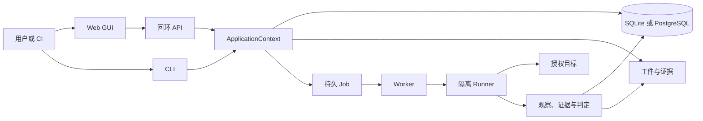

# 界鉴项目设计规范

> 状态：当前设计真源；适用阶段：0～6、7.1～7.2 与首次使用 C1～C4 已实现，8～9 尚未实现；生效日期：2026-08-18

本文只记录当前实现必须遵守的系统边界、数据不变量、公共协议和验证要求。完成流水账、旧教程、目录地图和历史决策不在本文重复；历史原因见 [ADR 索引](../02_技术决策/README.md)，当前路线见[开发路线图](../04_开发记录/开发路线图.md)。

## 1. 约束优先级与项目定位

“必须”“不得”是强制要求，“应该”是默认要求。冲突时依次服从：法律、比赛规则和目标授权；根目录 `AGENTS.md`；已接受 ADR；本文；模块内部说明。

界鉴面向 Vibe Coding Web 应用，验证安全意图是否落实到运行行为，并把结果作为本地或 CI 交付门禁。核心链固定为：

```text
安全意图 → 可执行契约 → 关系变异 → 多面观察 → 确认证据 → 回归门禁
```

最终结论必须能回溯到规则、请求、观察和证据；LLM 只能提出候选规则或解释，不能直接决定漏洞结论。

V1 的技术中心是：安全意图—运行行为契约编译与漂移检测，以及带因果标记的多观察者副作用判定。V1 不做未经授权的公网批量扫描、微服务拆分、完整代码审计、TUI、原生桌面壳或不可逆破坏性测试。

## 2. 当前入口与系统边界

用户可见阶段固定为：接入、录制、建约、测试、验证、报告。GUI、CLI、CI 必须复用同一 ApplicationContext、应用服务和领域引擎；REST 是 GUI/集成控制面，不是目标请求执行器。

系统采用模块化单体、持久化 Worker 和隔离 Runner：



- API 只管理资源、权限、任务、事件和结果读取，不执行浏览器操作、变异或目标请求。
- CLI 只负责校验、提交、等待、取消和展示；CI 复用 CLI 语义并返回稳定退出码。
- Worker 负责租约、编排、重试、取消、结果校验、发布和恢复。
- Runner 是主动目标流量的唯一进程；浏览器、HTTP 执行器和观察器均受 `TargetScope`、预算和清理策略约束。
- Domain、纯算法和公共协议不得依赖 FastAPI、SQLAlchemy、Playwright 或具体 LLM SDK；Storage 不执行目标请求；Results 只读已发布结果。
- 运行数据、缓存、秘密和证据只写 `var/` 或测试临时目录，不写源码目录，不提交 Git。

固定产品入口为 `start.cmd` → `scripts/start.ps1` → `jiejian serve --open`，安装脚本不得隐式访问模型、修改用户配置或覆盖秘密。Windows 首次准备、缓存和 `/ready` 门禁以 ADR-0019 为准。

## 3. 核心领域模型与状态

核心对象为 `Project`、`Recording`、`Flow`、`Requirement`、`ContractRule`、`ContractVersion`、`Run`、`TestCase`、`Observation`、`Evidence`、`Finding`、`Job` 和已发布报告。生命周期状态与安全结论必须分开保存。

安全链中的职责不变：

- `Project` 固定目标范围、身份、资源、Flow、Contract 来源和观察器配置。
- `Recording` 按 identity 使用独立的非持久浏览器上下文；脱敏事件经审阅后形成有版本的 `Flow`。
- `Contract` 由显式 YAML、Requirement、Flow 或受限候选产生；只有人工审阅并激活的版本可进入正式执行。
- `Verification` 读取不可变执行快照，执行关系变异、观察和判定。
- `Evidence` 保存规则、请求/变异、观察、因果标记、原因码、内容哈希和脱敏引用；`Verdict` 只能由确定性规则和证据产生。
- `Results` 校验发布清单、文件哈希和数据库完成态，再派生 Finding/报告，不重新执行验证、不修改 Verdict。

生命周期最低约束：

| 对象 | 关键状态或不变量 |
| --- | --- |
| ContractVersion | 草稿 → 审阅 → ACTIVE/REJECTED；ACTIVE 不可原地编辑；冲突候选不得自动激活 |
| Recording | 创建 → 录制 → 待审阅 → 已发布/失败；事件和 Flow revision 不可原地覆盖 |
| Run | 生命周期 `PENDING/RUNNING/COMPLETED/FAILED/CANCELLED/SAFETY_STOPPED`；结论另存 `PASS/BLOCK/INCONCLUSIVE` |
| TestCase | 计划、执行、观察和判定相互可追溯；缺观察面只能得到 `INCONCLUSIVE` |
| Job | `PENDING/RUNNING/RETRY_WAIT/SUCCEEDED/FAILED/CANCELLED`；租约、attempt、fencing token 和取消语义必须持久化 |
| Evidence/Finding | 内容寻址或稳定 ID；只读发布后结果；错误不能包装成安全结论 |

Run/Job/Verdict 矩阵遵循 ADR-0002：成功执行才允许写安全结论；取消、重试、基础设施失败和安全停止不得伪造 PASS/BLOCK。

## 4. 输入、安全内核与执行约束

### 4.1 TargetScope、身份和预算

- 只允许明确授权的本地或目标范围；协议、主机、端口、重定向、DNS、私网和路径必须在统一安全内核校验。
- 当前 V1 对验证目标允许规范化 IPv4 字面量，拒绝未固定授权地址的域名、IPv6 和混合表示；扩展前必须有传输层证据和 ADR。
- 身份、资源、Flow、Contract、观察器和来源文件必须来自自包含 bundle 或治理后的服务端快照；相对路径不得逃逸 bundle 根。
- 请求数、响应体、证据体积、并发、超时和总预算均有上限；超限进入安全停止或稳定错误。
- 变异只改变已声明字段，保持 seed 确定性；基线失败时不得执行误导性变异。

### 4.2 秘密、脱敏和副作用

- 真实秘密只能通过最小化的 Runner 环境注入；不进入 YAML 快照、协议、数据库、日志、浏览器存储、Evidence、报告或错误文本。
- 环境变量和凭据引用只保存名称或 `secret_ref`，读取、传递和输出均经过统一脱敏。
- 任何响应、嵌套字段、字符串片段、异常和事件中的秘密都必须变为 `[REDACTED]`。
- 拒绝响应伴随真实后端副作用时，依据多观察者因果证据判为 `BLOCK`；只有 HTTP 表象不足以形成结论。
- 清理失败必须停止、降级或明确报告，不得继续执行可能污染后续用例的动作。

### 4.3 Worker、Runner、发布与恢复

持久请求是执行真源：先严格校验并原子写入带哈希的快照，再由 Worker 使用当前租约构造 Runner 请求；Runner 不重新读取可变 YAML。

Worker 必须在有效 lease 和 fencing token 下工作。Runner 结果进入独立 staging，经协议、关联 ID、大小、秘密和哈希重验后，原子发布到：

```text
<var_dir>/projects/<project_id>/runs/<run_id>/
```

发布目录包含结果、全部声明工件和 `publication-manifest.json`。数据库完成态只能引用已发布且完整性通过的清单；发布后数据库提交失败由 reconciliation 幂等补齐；过期租约、旧 fencing token、孤儿目录和篡改工件只能拒绝或隔离，不能写入完成态。详细字段和顺序见 ADR-0002～0007 及[协议定义](../03_协议定义/Runner执行协议V1.md)。

## 5. Recording、Flow、Contract、Drift 与 LLM

- Recording Runner 只执行一次录制或回放；每个 identity 使用独立 `BrowserContext`，原始 trace、storage state、Cookie 和响应秘密不落盘。
- 事件先限长、脱敏，再按因果 ID 关联动作和请求；动态变量只能使用已确认来源。revision、审阅、发布和回放失败均可追溯。
- Flow 是可审阅的流程输入，不等于安全规则；回放每次创建新的 Job 和隔离会话，任一次失败都不得伪造整体成功。
- Requirement 是显式授权的意图来源；Candidate 是不可信候选；ContractVersion 的 assessment、diff、drift、review 和激活必须经过统一治理服务。
- Drift 至少覆盖意图新增、规则缺失、路由/字段变化、观察器不足、运行行为变化和 LLM 候选冲突。
- LLM 默认离线。模型只消费显式授权且脱敏有界的 Requirement，输出必须是严格版本化 JSON、携带 provenance，并继续走 Candidate → assessment → REVIEW/ACTIVE；模型不可用不影响无模型门禁。
- LLM profile 只保存非秘密配置和 `secret_ref`；出站 URL、重定向、预算、本机 HTTP 和 provider 协议族按 ADR-0020，不能复用 Runner 的目标授权。

## 6. Storage、协议、迁移与公共格式

- 数据库保存可查询生命周期、租约、事件、来源身份、治理绑定和 Evidence 索引；文件系统保存不可变执行请求、staging、发布工件和报告。两者通过哈希、manifest 和 UnitOfWork 关联。
- 所有公共 API、Worker/Runner 消息、机器文件和迁移新增公共数据带 `schema_version`；未知字段默认拒绝，尺寸、数量和字符串边界固定。
- `docs/03_协议定义/Runner执行协议V1.md` 是 Runner 字段级协议；`docs/03_协议定义/数据格式.md` 说明数据家族、版本、迁移和 Schema 定位。
- 跨进程机器 Schema 只保留在 `schemas/runner/` 和 `schemas/recording/`；不得复制到 README、测试 fixture 或数据库模型。
- Alembic migration 只向前演进；迁移不得删除或静默重写历史 Run、Evidence、Contract、Flow、秘密引用或已发布工件。公共接口/文件格式不兼容时必须提供迁移说明和测试。

机器契约的生产/消费和漂移测试分别位于 `backend/src/jiejian/protocols/`、`backend/src/jiejian/recording/`、`tests/execution/protocol/` 与 `tests/architecture/`；这只是定位信息，不替代协议正文和 Schema。

## 7. API、CLI、GUI 和测试

- API 路由只做严格解析、权限/来源校验、应用服务调用和脱敏错误映射；绑定回环地址，SSE 使用持久事件序号恢复。
- CLI 的 `project`、`recording`、`contract`、`run`、`report`、`ci` 和 `serve` 均调用共享应用服务；无交互输出、错误码和 JSON envelope 稳定。
- GUI 只展示服务端事实：六阶段入口、生命周期与 Verdict 分开；差分视图展示身份、请求、观察和副作用；`INCONCLUSIVE` 必须说明缺失观察或失败环节；LLM 候选标为待确认。
- 现行验证优先覆盖领域状态机、TargetScope/预算/脱敏、变异确定性、协议 Schema、Job lease/fencing/recovery、发布完整性、迁移、API/CLI/GUI 一致性和黄金样例。
- Python 检查必须设置 `PYTHONDONTWRITEBYTECODE=1` 并使用 `python -B`；语法检查优先 `ast.parse`。pytest 使用 `-p no:cacheprovider` 和 `var/` 下唯一 `--basetemp`，结束后精确清理。

## 8. 最低三层注释基线

注释服务于代码审查、边界识别和后续维护，不构成第二套设计文档。规则只要求最低可读性，不追求统一覆盖或逐文件教程。

### 8.1 文件层

具有独立业务、安全、协议、事务或编排职责的文件保留简短信息卡，至少说明定位、职责和主调用关系。简单文件一行即可。自动生成文件、migration、纯常量、只承担包标记的 `__init__.py`、测试 fixture 和固定资源不机械添加信息卡。

语言约定：Python 使用 `#` 注释，不使用模块级三引号作为信息卡；TypeScript/TSX 使用简短 `/* ... */` 文件卡；PowerShell 使用 `#` 说明文件/阶段及环境副作用或退出码；CMD/BAT 使用 `REM`，并保持薄入口。

### 8.2 类与函数层

仅在公共边界、非直观数据、关键不变量、副作用、安全限制、失败/清理语义或返回契约存在时保留 docstring/说明。显然的参数转发、直观 CRUD、简单属性和自解释分支不添加模板说明；组件显然的 props 不逐项复述。

运行时 introspection、框架发现或公共 API 明确依赖 docstring 时，可以保留其必要内容，但不得复制设计规范、调用链教程或阶段流水账。

### 8.3 行内层

行内注释只解释“为什么”、危险边界和反直觉处理，例如安全拒绝、事务顺序、fencing/lease、脱敏时机、清理失败或兼容分支的原因。不得把函数名、条件、赋值和调用顺序翻译成注释；发现只复述动作的长 docstring 时，触及时可删或压缩，不进行全仓清理。

### 8.4 变更边界

本基线不引入 lint、KPI、注释覆盖门禁或逐文件清单。新增或修改代码时只补足直接触及的边界说明；不为满足格式而批量改写既有源码，也不恢复目录 README 或额外解释层。

## 9. 首次使用交互与只读项目识别

首次使用的冻结交互由 [ADR-0022](../02_技术决策/ADR-0022-首次使用交互与只读项目识别.md) 约束。本节保留当前实现必须遵守的边界；C1～C3 已实现目录识别、快速/演示入口、向导、恢复和六阶段指导，C4 已通过真实演示发布链验收。

### 9.1 普通用户路径

- 欢迎页标题为“检查你的 Web 应用是否真的守住权限边界”，唯一主动作是“选择要检查的应用文件夹”，次动作是“先用演示项目体验”；模型服务不是必填。
- 识别页说明“我们只读取常见配置，不会运行脚本或安装应用依赖”，并展示识别技术、可能启动方式、配置/API/认证线索和缺项。
- 补充页按“应用怎样启动”“测试账号有哪些”“允许检查哪些地址”“检查后怎样恢复数据”提问；每项说明用途、例子、必填性和安全影响。
- 确认页要求用户显式确认文件推断出的命令、地址、私网授权、写操作和重置方式；禁止自动执行未知命令、安装目标依赖或扫描公网。
- “快速检查”采用最小安全默认值；“高级配置”承载多身份、复杂权限、观察器、预算和 CI，不新增业务阶段。运行后仍进入接入、录制、建约、测试、验证、报告六阶段。
- 每页都应回答当前做什么、为什么、缺什么和下一步；错误按“发生了什么—可能原因—现在怎么做”组织，内部错误码、trace 和日志仅在可展开诊断区出现。
- 普通路径不显示 Project bundle、Contract、Flow、Runner、Job、Attempt、fencing、observer、GatePolicy、schema_version 等内部词汇。高级诊断出现“租约”时固定解释为：“系统给后台检查任务的临时占用凭证，用来避免同一任务被重复执行；通常无需操作。”

### 9.2 C1 只读能力边界

- `onboarding` 是独立能力区，由 ApplicationContext 组合；API 只调用其应用服务。目录选择和识别是两个显式动作：选择只返回用户选定目录，识别才读取受限配置。
- Windows 选择器延迟导入标准库 `tkinter.filedialog`，仅在显式调用时打开；取消返回 `cancelled`，桌面不可用返回脱敏的 `unavailable` 和手工绝对路径提示。非 Windows/headless 不影响离线核心和启动。
- 识别输入必须是绝对、存在且为目录的 canonical 路径；根目录 symlink/junction/reparse 拒绝，子项不跟随并给出安全警告。扫描条目总数最多 256（目录、普通文件、`.env`、非 allowlist 条目各计一次），最多两层；单文件 256 KiB、总读取 1 MiB，候选最多 32 项。枚举逐项有界，未确认整层条目数前不得无界物化或排序；只读取 allowlist 配置文件。
- `.env` 及同类环境文件只记录存在，不读取变量名或内容；不读取数据库、源码正文或秘密。`package.json` 只把脚本名称转换为待确认的 `pnpm/npm/yarn run` 候选，绝不读取或执行脚本正文。
- C1 不调用 shell、包管理器、目标 Python/Node、网络、Git 或外部命令，不自动确认目标地址、账号、授权范围、写操作和恢复方式。结果使用版本化模型返回 `detected_types`、`start_candidates`、`config_hints`、`interface_hints`、`auth_hints`、`missing_items` 和 `warnings`。

### 9.3 C2a 快速检查后端边界

- 快速检查会话只保存非秘密答案到 `var/onboarding/`；凭据只在当前进程的内存 vault 中按会话保存，响应、JSON/YAML、数据库和日志均不得出现凭据值。会话以 revision 乐观并发更新，`SUBMITTED` 不静默改写；重启后凭据显示为缺失。
- 快速目标严格限制为带显式端口的 `http://127.0.0.1:<port>` 或 `https://127.0.0.1:<port>`；拒绝 `::1`、`localhost`、其他域名、用户信息、路径、查询、片段、私网和公网目标。高级配置继续使用现有 TargetScope 能力。
- 快速 bundle 只包含两个身份、两个资源、一条带 `{resource_id}` 的 GET 相对路径、`foreign_read`/`http` 规则、关闭 owner observer、禁止重定向和小请求预算。生成后必须由现有 loader 再次解析，再经既有项目注册和执行提交服务排队；不启动用户命令、不探测目标、不发目标请求。
- API 与本地 Worker 通过 ApplicationContext 的基础环境加内存秘密解析边界取得仅本次请求需要的秘密名称；不修改 `os.environ`，不向子进程传递无关秘密。

### 9.4 C2b 可信内置演示边界

- 内置演示只能由 `DemoRuntimeManager` 启动固定命令 `sys.executable -B -m jiejian.sample_app --variant vulnerable --port 0`；不得接受用户命令、模块、cwd、地址、环境字符串或 shell 输入。演示源目录固定为 `var/onboarding/demo/source`，只写受控非秘密配置。
- 子进程使用 `shell=False`、`stdin=DEVNULL`；stdout 只读取一次 ready 首行，必须严格匹配 `http://127.0.0.1:<port>`，10 秒内未收到或格式不符即停止。stderr 只写 `var/log/onboarding-demo.log`，响应只暴露脱敏原因和相对日志位置；API 不探测或请求演示目标。
- 演示凭据由后端随机生成，只进入当前进程 RuntimeSecretVault 和子进程的两个固定 sample 环境变量；基础环境不得携带其他 vault/LLM secret。C2a bundle 的两个 `env:` 引用仍由 Worker 的最小环境筛选注入。凭据不得进入 session JSON、bundle、数据库、日志、响应、异常或 repr。
- 演示 start/stop 由同一 manager 串行化；重复 start 在运行进程或已提交事实下幂等，stop/close 使用 terminate、有界等待和 kill fallback，不删除已排队 Run 或报告。状态只提供 `stopped/starting/running/failed`、演示标记、会话/项目/运行/任务标识和普通用户提示。
- 内置演示只设置固定的项目、两个演示身份和资源、`GET /resources/{resource_id}`、`POST /reset` 及四项可信确认，然后复用 C2a `create_session`、`put_credentials`、`update_session`、`quick_check`；不复制 bundle、项目登记或执行规则。`start_worker=False` 时仍只排队，完整执行和报告不在 C2b 承诺范围内。

### 9.5 C3～C4 当前实态

- C3 的 React 首次使用向导默认提供系统目录选择、只读识别、四步普通信息补充、两份凭据的一次性提交、快速检查和内置演示；高级 YAML 入口保留。浏览器只保存 onboarding `session_id` 和已选项目标识，不保存密码、启动命令或其他秘密。
- C3 的刷新恢复重新读取服务端会话和识别结果，按实际缺项定位步骤；`SUBMITTED` 会话只读。错误主层使用“发生了什么—可能原因—现在怎么做”，错误码和 trace 只在诊断区显示；页面重试会重新读取当前能力页。
- 测试、验证和报告页面只依据真实 Run lifecycle、`result_integrity` 和已发布工件导航或显示结论；FAILED/CANCELLED 不进入验证，未发布工件不作为全局错误。内置演示页及后续结果页保留“演示数据，不代表真实项目”提示。
- C4 已通过真实 `create_app(start_worker=True)` 演示链到 `COMPLETED`、`VERIFIED`、PASS，浏览器访问本地 dist 完成测试→验证→报告、刷新恢复、演示幂等和 480/768/1280 无水平溢出验收；不改变六阶段、执行核心或公共协议。

## 10. 当前实现与未来边界

阶段 0～5.6 已实现：接入、录制、建约、测试、验证、报告六阶段外壳；CLI、回环 API、React GUI；Contract/Drift/LLM Candidate 治理；Recording 与回放；持久 Job、Worker、隔离 Runner；Runner/Recording 协议、迁移、原子发布、Evidence/Results、Windows 一键准备和黄金样例。

阶段 6 已完成权限关系纯模型、V2 公共 Schema、确定性关系覆盖、Observer V2、多面只读观察、Verification V2 纯判定和 Runner V2 Evidence/Result 闭环。Profile 服务将计划确定性编译并冻结到 V2 请求快照，既有 Worker 继续监督持久请求、lease/fencing/recovery、staging 和原子 publication；0008 只保存非秘密 Profile 摘要，完整 Profile/计划/快照仍留在源文件与 request/publication 链。`/api/v2`、`permission-run`、测试页、验证页和 fixed/vulnerable/inconclusive 无秘密正式样例均已接线，V1 ownership、历史工件和 jobs/runs 字段不变。7.1 稳定 Finding 与 7.2 回归基线/门禁已实现；阶段 8 统一报告仍未实现。详细版本和迁移决策见 [ADR-0023](../02_技术决策/ADR-0023-阶段6至9能力演进与版本边界.md)，实施批次和验收见路线图。

### 10.1 权限与观察演进边界

- V1 `RuleKind + FlowStep + Identity + ResourceDefinition` 和 `http + owner_api` 继续只解释历史所有权 Run；不得在 `schema_version="1"` 上增加可选新语义。
- V2 以 subject、action、resource、relation、context、expected result 表达权限意图，并编译到一份规范化 Verification 用例表示。Contract 显式声明 `role_ids`；主体角色、动作、工作流状态和关系事实必须可解析，关系路径必须从规则主体有向连续到规则资源，非空 context 必须与该资源及其作用域事实一致。阶段 6.1 的模型和 Schema 已实现；复杂权限执行通过 Runner V2 的独立输入与工件边界承载，V1/V2 不形成两套执行和判定核心。
- 复杂关系首版限于已声明的角色、部门、租户、所有权、资源/管理层级、工作流状态、有限批量集合和有限无环关系图上的有界继承；缺少事实不能猜测或默认允许。6.2 覆盖计划已实现角色、租户、部门、关系、工作流和批量维度的最近禁止邻居、预算 gap、语义去重及稳定 finding 前置身份；该前置身份不是阶段 7 最终 Finding ID。
- 覆盖由基线、最近禁止邻居、显式风险交互和确定性约简产生，不计算全笛卡尔积。计划必须保存来源、关系路径、约简理由和覆盖 gap；预算不足或 required observer 不完整时不能 PASS。
- Observer V2 明确 target、before/after/eventual window、correlation、completeness、unavailable、预算和最小 secret 集。HTTP、只读数据库、审计/异步、消息队列和对象存储观察均只能在 Runner 隔离域内的固定适配器执行；API/Worker 不查询目标或解释观察结论。
- 阶段 6.3 已完成 Observer V2 严格公共 DTO、规范 JSON/hash、完整性/因果 Outcome 语义、owner_api 到 V1 Observation 的兼容投影，以及 Runner 隔离域内固定 `resource-state` 只读 SQLite 子进程。SQLite 只接受预注册模板、`mode=ro`/`query_only`、参数化 resource_id 和行/字节/时间预算；监督器只注入 `env:` 引用的单一 secret，输入输出无秘密且精确清理。fixed/vulnerable 配对已证明同一 HTTP 403 可分别对应 SQLite 状态不变或状态变化；required 观察失败仍为 INCONCLUSIVE，子进程/协议错误为 EXECUTION_ERROR。阶段 6 Runner V2 已在独立协议上接入执行时序和 Evidence/Result 工件生产；本批进一步通过既有 Worker 生命周期接入持久请求、staging、原子 publication 和基础结果读取，不改变 V1 工件与结论；测试页高级复杂权限入口与验证页 V2 Evidence 展示已在后续批次接线。
- 阶段 6.4 已完成结构化审计日志和异步任务状态观察器，并补充 fixed/vulnerable/inconclusive 三类本机异步因果样例：观察器均在 Runner 隔离子进程内，通过固定只读适配器、显式 case correlation、有界窗口和严格 provenance 输出 Observer V2。审计日志只读授权根顶层固定 JSONL 轮转族；异步任务只读显式 IPv4 origin 的固定 request-marker API，并区分目标任务 `TIMED_OUT` 与观察窗口超时。样例测试将 `http`、`audit_log`、`async_task`、`final_side_effect` 四面事实分开，缺失/冲突 tag、状态倒退、预算耗尽、路径或网络越界和数据损坏不得用时间邻近补因果；required 观察只能 INCONCLUSIVE。上述观察器已由 Runner V2 执行编排调用，并由 Worker/publication bridge 接收其 V2 结果；Queue 与 Blob 观察在阶段 6.5 完成。
- 阶段 6.5A 已冻结 Azure Queue Peek 与 Azure Blob Object 的 Observer V2 协议和 Schema：公共服务只接受规范 HTTPS account endpoint，本机只接受显式授权的 `127.0.0.1` HTTP endpoint；SAS 仅以 `env:` 引用表达，测试队列/container 必须独立，预算、字段 allowlist、Blob prefix 和阶段限制由模型严格校验。Queue Peek 与 Blob Object 均已在 Runner 隔离子进程中实现固定 REST 只读适配器，并通过本机 Azurite 动态验证；已具备 Runner V2 观察编排调用面，且无秘密样例正式入口已完成；Queue/Blob 不得由 API 或 Worker 直接访问目标。
- 阶段 6 的 Verification V2 纯判定叶已实现：只接受已脱敏、已校验的请求/观察事实，按单资源或批量 resource×phase 归约副作用并确定性返回 CaseVerdict/专用原因码；不依赖 Runner、Observer、HTTP 或存储，现由 Runner V2 显式投影调用。

### 10.2 Finding、回归与门禁边界

- Evidence 是单次 Run/Case 的不可变事实；Finding 是跨 Run 的稳定问题；FindingOccurrence 连接一次运行中的出现、消失或重现。三者不得仅因字段相似而合并。
- 阶段 7.1 已实现 Finding/FindingOccurrence 的独立持久化：稳定身份至少包含 project、权限意图/规则、subject 类、action、resource 类/关系和问题类别，稳定 ID 不含 Run、Case、时间、随机值、实际对象值或秘密；Occurrence 只引用已发布、不可变 Evidence ID。
- V1 `/api/v1/runs/{run_id}/findings` 保持单次 Evidence 历史投影；稳定 Finding 使用 `/api/v2/runs/{run_id}/findings` 查询边界，并且只能由 PublishedResultReader 校验通过的 V1/V2 publication 事实物化。
- RegressionBaseline 必须由操作者显式接受并保存 Run、Finding 集、覆盖清单、版本、时间和理由；最新 Run 不自动成为基线。
- 阶段 7.2 已通过 `0010_stage7_gate` 持久化 RegressionBaseline/GateResult；基线接受只允许显式 actor+reason 和已发布 COMPLETED Run，GateResult 只从 PublishedResultReader 已验证事实生成并保持不可变重放。
- GatePolicy 读取已发布结果和基线生成独立 GateResult，不修改 Verification Verdict。新 BLOCK、重现、覆盖退化、INCONCLUSIVE、required observer 缺失和执行/发布错误分别产生稳定 BLOCK/ERROR 原因；新 CLI/API 使用明确 v2 边界，旧 `ci` 退出语义不变。

### 10.3 产物与报告边界

- 产物检查使用独立 JobHandler 和隔离进程，只读取显式 staging 工件和 manifest；拒绝路径逃逸、链接、无界遍历、工件执行和在线规则更新，并受文件、字节、时间和结果预算限制。
- 每个新 Run 的版本化 `report.json` 是 HTML、SARIF、JUnit 的唯一语义真源。渲染器只做确定性格式转换，不重新判定。历史 V1 报告原样读取；新 reader/API/CLI 通过显式版本和兼容投影保持旧字段与退出语义。

### 10.4 进程、版本与持久化边界

- Runner V2 只用于复杂权限、多观察者和 V2 Evidence；正式 Runner 进程入口保持稳定。V1 与 V2 协议、Schema 和漂移测试并存，但共享同一 Verification 核心。
- Runner V2 Evidence 通过 requirement binding 将 requirement_id 显式映射到 observer_id/type 和完整 phase 集合；观察 binding 只允许 BEFORE/AFTER/EVENTUAL，OWNER_API 还必须携带非秘密的 `owner_api_credential_ref`。批量 case 还必须按 resource_id×phase 提供逐资源 envelope，安全结论要求每个声明单元均为 COMPLETE/CORRELATED 且 outcome 可用。请求未收到响应只能记录稳定 failure_code 并保持 INCONCLUSIVE；Evidence ID 为语义 hash 前缀，V1 工件不变。当前 Runner V2 已负责时序、秘密二次解析、观察器调度和 staging 工件原子写入。
- 新表/列只在阶段实现时通过只向前 migration 增加，不改写 V1 行和历史工件。Job/attempt/lease/fencing/cancel/retry/recovery/staging/publication 语义保持不变。
- 阶段 7.1 通过 `0009_stage7_findings` 新增 `findings` 与 `finding_occurrences` 表；迁移不改写 V1 Evidence Index、Run 或已发布工件，Occurrence 历史记录不原地更新。
- 阶段 7.2 通过 `0010_stage7_gate` 新增 `regression_baselines` 与 `gate_results` 表；基线和 GateResult 只保存版本化摘要、不可变引用和确定性原因，不改写 Finding/Occurrence、Evidence 或 publication。
- 生命周期、Verification Verdict 和 GateDecision 分开保存；LLM 只能生成候选或解释，不能接受基线、选择最终覆盖或决定门禁。

阶段完成必须同时满足：功能和不变量测试通过；文档、Schema、迁移和实际行为一致；无秘密泄漏；失败/取消/INCONCLUSIVE 可演示；运行态仅写 `var/` 或临时目录；CLI 无交互路径稳定；已知限制明确记录。

## 11. 相关真源

- 协作、安全、权限、提交和注释规则：根目录 `AGENTS.md`。
- 当前工作顺序和阶段验收：[开发路线图](../04_开发记录/开发路线图.md)。
- 字段级进程协议与数据格式：[Runner执行协议V1](../03_协议定义/Runner执行协议V1.md)、[数据格式](../03_协议定义/数据格式.md)。
- 当前决策及取代关系：[ADR 索引](../02_技术决策/README.md)。
- 可运行黄金 bundle：`samples/fixed_apps/ownership/`、`samples/vulnerable_apps/ownership/`、`samples/inconclusive_apps/ownership/`。
- 最小测试定位：`tests/architecture/`、`tests/domain/`、`tests/verification/`、`tests/execution/`、`tests/storage/`、`tests/api/`、`tests/e2e/`。

## 12. 修订记录

| 日期 | 说明 |
| --- | --- |
| 2026-08-13 | 收敛为当前设计、安全和公共边界真源；删除完成流水账、重复目录说明和旧教程，阶段 0～5.6 与 6～9 规划边界改由路线图维护。 |
| 2026-08-13 | 冻结最低三层注释基线；只约束文件卡、必要的类/函数说明和解释原因的行内注释，不引入覆盖门禁或批量源码改写。 |
| 2026-08-13 | 完成 C3～C4 首次使用前端向导、六阶段指导、错误/结果恢复和真实演示发布链验收。 |
| 2026-08-13 | 以 ADR-0023 冻结阶段 6～9 的复杂权限、多观察者、Finding/回归门禁、产物检查、统一报告、评测与版本兼容边界。 |
| 2026-08-13 | 完成阶段 6.1 权限关系模型基础；V2 仍不进入 Runner 执行。 |
| 2026-08-13 | 完成阶段 6.2 确定性关系覆盖、批量规划和本机三变体样例；Runner 仍只执行 V1。 |
| 2026-08-14 | 完成阶段 6.5 Azure Queue Peek/Blob Object Runner 隔离只读适配器及 Azurite 动态验证；已纳入 Runner V2 观察编排，未新增 Queue/Blob 专属普通用户配置与动态黄金样例。 |
| 2026-08-18 | 完成阶段 6 复杂权限、多面观察、Runner/Worker/publication、无秘密三变体正式样例和阶段级一致性验收；阶段 7～9 仍未开始。 |
| 2026-08-18 | 完成阶段 7.1 Finding/FindingOccurrence、0009 只向前迁移、V1/V2 Results 兼容查询和两 Run 出现/消失闭环；7.2～9 未开始。 |
| 2026-08-18 | 完成阶段 7.2 RegressionBaseline、GatePolicy、GateResult、0010 只向前迁移及 v2 API/CLI 门禁接线；阶段 8～9 未开始，旧 `ci` 语义保持不变。 |
| 2026-08-13 | 文档目录收敛为开发规范、技术决策、协议定义和开发记录四类；删除不再维护的竞赛资料目录并统一活动引用。 |
