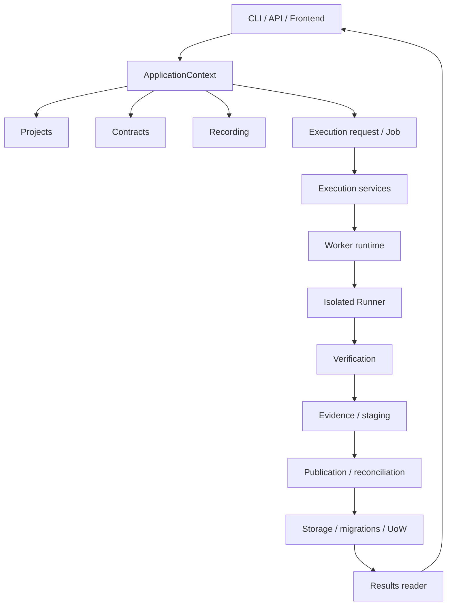

# 系统架构

## 当前形态

界鉴是模块化单体。CLI、回环 FastAPI、React GUI 和本地启动编排共享 ApplicationContext；主动验证进入独立 Worker/Runner 进程边界。阶段 0～5.6 工程与联调已经完成，阶段 6/7 尚未开始。

## 依赖方向

- `domain` 和 `verification/models.py` 保持纯模型边界，不依赖 FastAPI、SQLAlchemy、Playwright、Execution 或 Results。
- `protocols` 只定义严格的跨进程模型；签入 JSON Schema 位于仓库根 `schemas/`。
- `projects` 不反向了解 Contract Governance 或执行请求；`contracts` 不直接执行目标。
- `recording` 可以组合 Execution 端口；Execution 不导入 Recording。
- `execution` 拥有通用 Job/Attempt、租约、取消、重试、恢复、监督和 publication；不复制 Recording 生命周期规则。
- `storage` 拥有数据库、ORM/Repository、迁移、UnitOfWork 和 Job 原子边界；不发目标请求。
- `runner` 是唯一把 Runner V1 请求连接到 Verification 目标 I/O 的进程；API/CLI/Worker 不直接发目标请求。
- `results` 只读取已发布工件、Evidence Index、Run/Job 和不可变请求，不重新执行、不改 Verdict。

架构依赖与入口边界由 [`tests/architecture/test_dependencies.py`](../../tests/architecture/test_dependencies.py) 保护。原因和历史迁移见 [ADR 索引](../03_技术决策/README.md)。

## 进程与资源边界

### CLI、API、Frontend 和 Runtime

`jiejian.cli:main` 负责参数、校验、提交、等待和展示；`jiejian.api:create_app` 只提供回环控制面；Frontend 通过能力 API 调用控制面。`runtime` 管理 `serve` 的 Worker 子进程、单实例锁、配置和诊断，`/api/v1/system/status` 只读返回运行状态，不触发目标流量。Windows 首次准备由 `start.cmd` 薄转发至 `scripts/start.ps1`，不复制 `serve` 生命周期。

### Worker 和 Runner

Worker claim Job、维护租约和 fencing token、监督一次隔离 attempt、处理取消/重试/恢复，并校验后发布 staging。Runner 只接收不可变 request snapshot 和最小秘密环境，只写当前 attempt staging，不写数据库或最终 Run 目录。`jiejian.worker.runtime` 是稳定的单任务进程入口。

### Storage 和文件系统

SQLite 保存公共 ID、状态、租约、审计、事件和 Evidence Index；文件系统保存 request snapshot、staging、发布工件、manifest、报告和 quarantine。publication 完整成功后，UnitOfWork 才提交数据库完成态；提交失败由 reconciliation 幂等收敛。

## 不变量

- 目标范围、身份、预算、秘密引用和 `schema_version` 在进入 Runner 前严格校验。
- 真实秘密不写入请求快照、日志、协议、数据库或报告；只按需进入 Runner 子进程环境。
- 旧 fencing token、错误 attempt、孤儿 staging 或不匹配 manifest 不能写入完成态。
- `PASS`、`BLOCK`、`INCONCLUSIVE` 是安全结论，基础设施/协议错误不得伪装成 `INCONCLUSIVE`。
- 历史 Run 读取执行时快照；已发布结果读取必须复验 manifest、数据库状态和哈希。
- 未授权公网目标、生产源码修改、阶段 6 Reporting/GatePolicy 和阶段 7 评测集不在当前能力范围。
