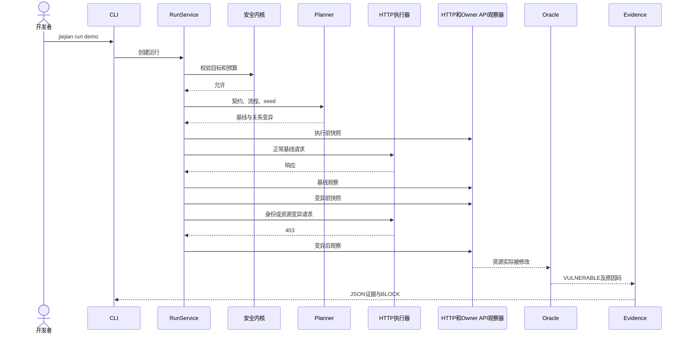

# 界鉴初步开发计划

> 状态：V1 执行计划
> 日期：2026-08-08
> 依据：docs/02_开发规范/项目设计规范.md 与 docs/03_技术决策/ADR-0001 至 ADR-0008

## 1. 初步开发目标

初步开发不以“先把所有页面做出来”为目标，而以完成一个可复现、可解释、可自动回归的安全验证纵切为目标。

第一个可用闭环必须能够：

1. 从本地项目配置加载两个测试身份和一个资源所有权契约。
2. 执行一条正常请求作为基线。
3. 通过 IdentitySwap 或 ResourceSwap 生成关系变异。
4. 同时观察 HTTP 结果和资源所有者视角的真实状态。
5. 识别“接口返回拒绝，但后端副作用已经发生”的情况。
6. 生成带哈希的 JSON 证据与稳定门禁结论。
7. 通过同一 CLI 命令在本地和 CI 中重跑。

在这个纵切稳定之前，不开始大规模 GUI、LLM、插件市场、通用扫描器或分布式调度。

## 2. 开发顺序总览


每一阶段必须满足验收条件后再扩展下一层。可以提前做小型技术实验，但实验代码不得未经整理直接进入核心路径。

## 3. 阶段 0：工程骨架与不变量

### 3.1 目标

建立最小、可运行、可测试的 Python 工程和规范约束，不实现完整业务。

### 3.2 首批文件

```text
界鉴/
├─ AGENTS.md
├─ README.md
├─ pyproject.toml
├─ .gitignore
├─ config/
│  └─ default.toml
├─ docs/
├─ backend/
│  └─ src/
│     └─ jiejian/
│        ├─ __init__.py
│        ├─ cli.py
│        ├─ errors.py
│        ├─ redaction.py
│        ├─ domain/
│        │  ├─ lifecycle.py
│        │  └─ state_machines.py
│        └─ runtime/
│           ├─ config.py
│           ├─ diagnostics.py
│           └─ logging.py
├─ tests/
│  ├─ unit/
│  └─ fixtures/
└─ var/
```

var/ 目录只保留占位说明或由运行时创建，实际内容加入 .gitignore。

### 3.3 实现内容

- 配置加载与优先级。
- Project、Contract、Run、TestCase、Job 的最小领域模型。
- 生命周期与结论枚举。
- 状态转换函数和非法转换错误。
- 稳定内部错误结构。
- CLI 根命令及 doctor。
- 结构化日志基础。
- 测试临时目录约束。

### 3.4 doctor 最低检查

- Python 版本与依赖。
- 配置是否可加载。
- var 目录是否可写。
- SQLite 能否启用 WAL 和外键。
- Playwright 仅报告可用性，阶段 0 不要求安装浏览器。
- 本机环回网络能力。
- 脱敏器基本自检。

### 3.5 验收

- jiejian --help 和 jiejian doctor 可运行。
- 配置优先级有单元测试。
- 所有非法状态转换均被拒绝。
- 运行测试前后源码树不新增 **pycache** 或 .pyc。
- 规范中的目录和实际工程骨架一致。

## 4. 阶段 1：CLI 安全验证纵切

### 4.1 目标

在不依赖 GUI、录制器、LLM 和插件系统的情况下，用人工提供的 Flow 与 Contract 完成第一个真实证据闭环。

### 4.2 场景

建立一个最小示例应用，包含：

- owner 和 attacker 两个账号。
- owner 拥有一个资源。
- 一个正常实现和一个故意存在缺陷的实现。
- 缺陷版本在收到越权更新时先写数据库，再返回 403。
- 所有者查询接口可确认资源是否被修改。
- 测试专用 reset 接口只监听测试环境。

这个场景专门验证“HTTP 表象不等于真实副作用”，应作为首个黄金样例。

### 4.3 当前最小模块

```text
backend/src/jiejian/
├─ domain/
│  ├─ identifiers.py
│  ├─ lifecycle.py
│  ├─ verification.py
│  └─ state_machines.py
├─ runtime/
│  ├─ config.py
│  ├─ diagnostics.py
│  └─ logging.py
├─ verification/
│  ├─ inputs.py
│  ├─ safety.py
│  ├─ planning.py
│  ├─ http.py
│  ├─ evaluation.py
│  ├─ artifacts.py
│  └─ pipeline.py
├─ errors.py
├─ redaction.py
├─ sample_app.py
└─ cli.py
```

这些模块按输入、授权、计划、目标 I/O、判定、证据和编排形成 DAG。若若干小文件只承载少量且没有独立边界的逻辑，应合并到同职责模块，避免机械拆分。

### 4.4 第一次运行的调用逻辑



### 4.5 首批命令

```text
jiejian project validate samples/fixed_apps/ownership/project.yaml
jiejian contract validate samples/fixed_apps/ownership/contract.yaml
jiejian run samples/fixed_apps/ownership/project.yaml --contract samples/fixed_apps/ownership/contract.yaml
jiejian report <run_id> --format json
jiejian ci samples/fixed_apps/ownership/project.yaml
```

### 4.6 首批判定规则

只实现明确的关系预言机：

- 所有者可读，非所有者不得读。
- 所有者可改，非所有者不得产生修改副作用。
- 普通用户不得通过字段修改提升角色或转移所有权。

暂不实现自由文本漏洞分类。原因码必须稳定，例如：

- FOREIGN_RESOURCE_OBSERVED
- UNAUTHORIZED_SIDE_EFFECT
- PRIVILEGED_FIELD_ACCEPTED
- REQUIRED_OBSERVER_MISSING
- BASELINE_PRECONDITION_FAILED
- CLEANUP_FAILED

### 4.7 验收

- 对正常样例输出 PASS。
- 对缺陷样例输出 BLOCK。
- 对关闭 owner_api 观察器的样例输出 INCONCLUSIVE。
- HTTP 返回 403 但资源变化时仍输出 VULNERABLE。
- 相同 seed 产生相同用例顺序和指纹。
- 证据中不存在测试口令、Cookie 或令牌。
- CI 退出码与规范一致。

### 4.8 当前实现映射

阶段 1 的当前实现按 ADR-0004 组织：

- `domain/verification.py`：TargetScope、Flow、Contract、变异、观察、证据与运行结果模型。
- `verification/inputs.py`：安全 YAML、项目内相对引用和跨文件校验。
- `verification/safety.py`：IPv4 字面量、origin、端口与重定向边界；阶段 1 拒绝域名和 IPv6，避免 DNS 重绑定窗口。
- `verification/planning.py`：确定性关系变异、固定 seed 和用例指纹。
- `verification/http.py`：唯一目标 HTTP 边界与执行预算。
- `verification/evaluation.py`：ownership oracle、证据构建和门禁聚合。
- `verification/pipeline.py`：`RunService` 同步编排基线、变异、前后观察和清理。
- `verification/artifacts.py`：规范 JSON、哈希校验和临时目录原子提交。
- `sample_app.py`：只绑定 127.0.0.1 的 safe/vulnerable 标准库样例。

阶段 1 不创建数据库、队列、Worker、Runner、Playwright、API、GUI、LLM、插件或完整 SARIF/HTML/JUnit 报告；这些能力仍按后续阶段验收后引入。

## 5. 阶段 2：持久化任务、Worker 与 Runner

### 5.1 目标

把阶段 1 的同步纵切迁移到可恢复任务，不改变领域判定。

### 5.2 阶段 2.0：协议冻结

在创建数据库和进程前完成 ADR-0002 与 Runner 协议 V1：

- 冻结项目、Run、Job、Evidence 公共 ID 规则和 UTC Unix 微秒时间边界。
- 冻结 Run lifecycle、Job state、Run verdict、尝试结果与清理结果矩阵。
- 冻结幂等键、请求哈希、attempt、max_attempts、available_at_us、租约、取消时间和 fencing token 语义。
- 定义严格冻结的 RunnerInputV1 和 RunnerResultV1，签入当前 Pydantic 生成的 JSON Schema。
- 输入嵌入 TargetScope、Identity、ResourceDefinition、Flow 和 SecurityContract 内容快照，不携带可变 YAML 路径。
- 实现重复键、未知字段、未知版本、NaN/Infinity、规范 JSON、哈希和解析前大小限制。
- 冻结 staging、Worker 校验、原子 promote、数据库 Unit of Work 和 reconciliation 的顺序。
- 明确阶段 2.3 后 CLI 不再进程内发出目标流量。

阶段 2.0 不实现数据库、Repository、UnitOfWork、Worker、Runner、队列或子进程，也不改变阶段 1 的 CLI 与 RunService 行为。

### 5.3 阶段 2.1：持久化映射

- 使用 SQLAlchemy 2 typed declarative 映射 `projects`、`runs`、`jobs`、`job_events`、`evidence_index`，不预建未来表。
- 第一版 Alembic 向前迁移是生产建库入口，重复升级到 head 稳定；不以 `create_all` 掩盖迁移缺陷。
- 具体 Repository 只接收/返回冻结 record；UnitOfWork 显式 begin/commit/rollback/close，异常和未提交退出均回滚，不公开 Session。
- SQLite 每个新连接启用 WAL、外键和 5000 ms busy timeout。
- 复用既有公共 ID，不生成第二套公共 ID；所有数据库绝对时间由调用方以 UTC Unix 微秒整数传入。
- Evidence 只保存索引，Job Event 只保存有限元数据；正文、响应体、日志和秘密不得进入数据库。
- 本阶段只建立映射、约束和事务边界，不实现 Worker、租约算法、Runner 或工件发布。

### 5.4 阶段 2.2：持久化 Job 与 Worker

- 已在阶段 2.1 五表上实现面向提交者的 `JobQueueService`、面向当前尝试的 `JobAttemptService`、面向监督恢复的 `JobRecoveryService` 与原子 Job 控制 Repository，不增加表、列、索引或迁移。
- 幂等提交在一个 UnitOfWork 创建 QUEUED Run、PENDING Job 和首个事件；相同作用域/哈希复用，不同哈希稳定冲突。
- PENDING/RETRY_WAIT 的 claim 采用确定顺序和数据库条件更新；成功时 attempt、fencing token 单调增加，首次将 Run 推进到 PREFLIGHT。
- 续租、首次取消、等待态直接取消、运行态清理确认、可重试/致命失败均与连续事件同事务。
- 重试使用有上限的指数退避和可注入抖动；尝试耗尽写 Job/Run=FAILED 且 verdict 为空。
- 租约过期只列为恢复候选；只有匹配 owner/token 且携带稳定退出或清理证明时才解除 RUNNING，恢复后旧 token 永久失效。
- 本阶段没有 SUCCEEDED/COMPLETED、Runner、目标 I/O、工件发布或 CLI 调度切换。

### 5.5 阶段 2.3：隔离 Runner

- 已将严格校验后的执行内容规范化写入 `<var_dir>/jobs/<job_id>/request.json`，以 request_hash 绑定；Worker 不依赖提交进程或可变 YAML。
- 一个 Runner 尝试执行一个完整 Run，不按 TestCase 拆进程；阶段 1 路径输入和 Runner V1 输入共同调用快照执行核心，不复制计划、判定或证据规则。
- 真实秘密只通过固定系统允许列表加本次引用组成的最小子进程环境传递，不进入 argv、协议、日志、结果、数据库或回执。
- Worker 监督 claim、续租、取消安全点、有界终止和严格结果/工件校验；旧 token 和过期租约结果拒绝。
- Runner 只生成 RunnerResultV1 和 attempt staging 工件；进程退出码 0/64/70/74 只表达可信结果文件是否形成。
- CLI 与 CI 已切换为提交、启动独立 Worker、等待和展示可信结果；所有目标流量只由 Runner 发出。
- 阶段 2.3 的交付点把 SUCCESS/SAFETY_STOPPED 停留在可信 staged result，不提前写 SUCCEEDED/COMPLETED；阶段 2.4 在此边界之后完成发布和数据库终态。

### 5.6 阶段 2.4：工件发布与恢复

- Worker 在当前有效租约下严格校验 receipt、RunnerResult 的关联 ID、attempt、lease owner、fencing token，以及 staging 的精确文件集合、受控相对路径、字节数和 SHA-256。
- 完整 attempt staging 原子发布到 `<var_dir>/projects/<project_id>/runs/<run_id>/`；不可变 `publication-manifest.json` 固定发布身份、租约、结果和全部文件哈希。旧 fencing token 的结果永不发布。
- 原子发布成功后，才在一个 UnitOfWork 中写 Run、Job、连续事件和 Evidence 索引完成态；SUCCESS 映射 COMPLETED/SUCCEEDED 与 verdict，SAFETY_STOPPED 映射安全停止/SUCCEEDED 且无 verdict。
- reconciliation 能幂等补齐“发布成功但数据库提交失败”；不匹配当前 attempt/token 的 staging 或 published 目录进入受控 quarantine，不被广泛删除，也不能补写完成态。
- 过期租约仍遵守恢复审计：未确认旧执行退出或清理完成前，不生成新尝试或目标副作用。`run`/`ci` 等待发布和数据库终态，`report` 只读取校验通过且数据库已完成的发布结果。

### 5.7 进程边界测试

- API 或 CLI 提交任务后退出，Worker 仍可完成。
- Worker 被终止后，租约过期可恢复。
- Runner 被终止后，运行进入明确错误或恢复路径。
- 同一幂等键不会生成两个 Run。
- 取消后仍执行清理。
- API 进程没有目标请求能力。
- Runner 协议 Schema 漂移、重复键、非有限数、大小限制、状态矩阵和 fencing 匹配均有独立测试。
- 租约过期但旧 Runner 仍存活时不产生第二次目标副作用。
- promote 成功而数据库提交失败时，reconciliation 能幂等收敛。

### 5.8 验收

- 阶段 1 全部黄金结果不变。
- 任务状态、运行状态和结论相互独立。
- 重启后可查询历史运行和证据。
- 连续运行不会把会话状态泄漏给下一个运行。
- 阶段 2.0 的 RunnerInputV1、RunnerResultV1、签入 Schema、ADR 和协议文档字段完全一致。
- 基础设施与协议错误不会被记录为 INCONCLUSIVE。
- 数据库完成态不存在未发布工件引用，旧 fencing token 不能提交任何完成态。

## 6. 阶段 3：浏览器录制与流程标准化

### 6.1 目标

让普通开发者通过浏览器完成正常业务流程，系统生成可审阅 Flow。

### 6.2 先行技术实验

在正式集成前，用独立实验验证：

- Playwright 在 Windows 上的安装、启动和关闭。
- 页面动作与网络请求的稳定关联。
- 多标签页、弹窗、重定向和 WebSocket 的处理边界。
- 动态 ID、CSRF Token 和分页参数的提取。
- 登录态、Cookie、localStorage 的隔离与脱敏。
- 浏览器追踪文件的体积控制。

实验结论写入 `docs/03_技术决策` 或 `docs/04_协议定义`，不把实验脚本直接当生产实现。

### 6.3 处理流水线

```text
原始事件
→ 目标范围过滤
→ 秘密与个人信息脱敏
→ 动作归并
→ 请求和 UI 动作关联
→ 动态变量提取
→ 步骤依赖解析
→ 安全敏感字段标注
→ Flow 草稿
→ 用户审阅
```

### 6.4 验收

- 两个身份的登录态完全隔离。
- 原始录制落盘前已脱敏。
- 录制得到的 Flow 能至少连续重放三次。
- 动态资源 ID 不依赖硬编码。
- 跨出允许 origin 的请求被阻断并记录。
- 用户可以删除、合并、重命名步骤并确认变量来源。

## 7. 阶段 4：FastAPI 控制面与 Web GUI

### 7.1 目标

把稳定的 CLI 能力呈现为完整产品流程，GUI 不重新实现业务逻辑。

### 7.2 后端顺序

1. health、ready 和 OpenAPI。
2. 项目管理。
3. 录制任务。
4. 契约查看与激活。
5. 运行创建、取消和查询。
6. SSE 事件流。
7. 发现、证据和报告。

### 7.3 前端顺序

1. 应用壳、路由、API 客户端和错误边界。
2. 项目总览和接入。
3. 录制。
4. 建约。
5. 测试运行。
6. 验证和证据对比。
7. 报告。

### 7.4 UI 重点

- 在同一位置展示运行生命周期和门禁结论，但视觉上明确分开。
- 用差分视图展示基线身份、变异身份、请求差异和副作用差异。
- 对 INCONCLUSIVE 给出缺失观察器或失败环节，不使用模糊提示。
- 将模型候选标记为“待确认”，不伪装为已生效规则。
- 安全停止要显示被拒目标、预算或规则，但不泄漏秘密。

### 7.5 启动整合

jiejian serve --open 的实现顺序：

1. 加载配置并锁定 var 目录。
2. 执行数据库版本检查。
3. 启动 API。
4. 启动或连接本地 Worker。
5. 提供前端静态资源。
6. 等待 ready。
7. 打开本机浏览器。
8. 捕获退出信号，按 Runner、Worker、API 顺序优雅关闭。

### 7.6 验收

- GUI 和 CLI 对同一 Run 展示相同状态和结论。
- 页面刷新不会丢失运行进度。
- SSE 断开后可以通过事件游标恢复。
- serve 失败能返回非零退出码和明确错误。
- 浏览器关闭不自动终止正在清理的任务。

## 8. 阶段 5：安全契约、漂移与 LLM 候选

### 8.1 目标

从“人工编写契约”扩展到“多来源候选、人工确认、版本化和漂移检测”。

### 8.2 实现顺序

1. Requirement 和来源定位。
2. 需求文本的确定性解析。
3. 录制 Flow 推导候选关系。
4. 代码和路由适配器生成候选。
5. 候选合并、冲突和不可观察性检查。
6. 契约审阅与激活。
7. 版本差分和旧运行引用。
8. LLM 候选适配器。

LLM 放在最后接入，先证明没有模型也能完成契约的创建、验证和门禁。

### 8.3 漂移类型

- 意图新增但契约未覆盖。
- 契约规则存在但 Flow 或路由已消失。
- 路由或字段变化使规则不可执行。
- 观察器不再满足规则需要。
- 运行行为相对已接受基线改变。
- LLM 候选与显式需求冲突。

### 8.4 验收

- ACTIVE 契约不可原地编辑。
- 旧运行始终能定位原契约版本。
- 冲突候选不能自动激活。
- 模型完全离线时核心门禁仍可运行。
- 模型输入不含秘密和未授权源码。

## 9. 阶段 6：交付前产物门禁、报告与 CI

### 9.1 目标

把运行时证据与静态交付产物风险合并为一次可执行门禁。

### 9.2 首批产物检查

- 源码与构建目录中的 API Key、Token 和高熵秘密。
- .env、调试配置和本地数据库误打包。
- Source Map 暴露。
- 前端 Bundle 中的服务端秘密或管理端点。
- 默认口令、测试后门和调试路由。
- 宽松 CORS、调试模式和不安全安全头。
- 依赖锁文件与已知高危依赖。

产物检查产生独立 Evidence 和 Finding，不能与运行时用例混为一个状态机。

### 9.3 报告

- JSON：真源和程序集成。
- HTML：本地查看和比赛演示。
- SARIF：代码托管平台集成。
- JUnit：CI 测试结果。

报告摘要必须区分：

- 已确认漏洞。
- 证据不足。
- 产物泄漏风险。
- 契约漂移。
- 执行错误。
- 已修复并回归通过。

### 9.4 验收

- 同一 Finding 在不同报告格式中有稳定 ID。
- 报告脱敏测试覆盖所有格式。
- CI 可根据 GatePolicy 阻断。
- 关键用例 INCONCLUSIVE 时默认不能通过。
- 依赖数据库或秘密规则的更新版本可追踪。

## 10. 阶段 7：评测集与作品化

### 10.1 目标

形成可量化实验、稳定演示和比赛材料，而不仅是功能集合。

### 10.2 评测集设计

建议逐步构建 48 个以上可复现实例，按以下维度分层：

- 框架：至少覆盖两个后端和两个前端技术组合。
- 生成方式：不同模型、不同提示策略、人工修订与否。
- 漏洞类型：越权读写、字段越权、会话错误、秘密泄漏、部署误配、流程绕过。
- 表象：明确 2xx、明确拒绝、拒绝后副作用、异步副作用。
- 真值：缺陷版本与修复版本成对。

数量应服从真值质量；如果无法稳定复现，不为了凑数纳入正式数据。

### 10.3 实验指标

- 已确认漏洞准确率、召回率和 F1。
- INCONCLUSIVE 比例。
- HTTP 单观察者与多观察者的差异。
- 有无契约的差异。
- 有无关系变异的差异。
- 修复后回归检出率。
- 单应用耗时、请求数和证据体积。
- 模型候选对人工建约时间的影响。

### 10.4 消融实验

- 去掉安全意图，只做通用扫描。
- 去掉副作用观察，只看 HTTP。
- 去掉因果标记，只用时间窗关联。
- 去掉契约版本与漂移。
- 去掉 LLM 候选。

作品的论证重点是前四项对准确性和可解释性的影响，不应只比较扫描数量。

### 10.5 演示链

稳定演示固定为：

1. 导入一个 AI 生成 Web 应用。
2. 录制 owner 正常操作。
3. 从需求和流程建立所有权契约。
4. 运行身份交换变异。
5. 展示接口返回 403。
6. 展示 owner 视角资源实际被修改。
7. 形成确认证据并阻断。
8. 切换修复版本重新运行。
9. 展示回归通过和报告差分。

演示应用、数据和浏览器版本全部锁定，准备离线兜底。

## 11. 建议的首轮开发任务

以下是开始编码后的首轮任务，顺序不可随意打乱：

1. 创建 Python 包、依赖锁、配置和测试入口。
2. 实现领域枚举、状态机和错误类型。
3. 实现 TargetScope 规范化与安全拒绝。
4. 定义 Project、ContractRule、Flow、Run、TestCase、Observation、Evidence 的最小 Pydantic 模型。
5. 定义 Mutator、Executor、Observer 和 Oracle 协议。
6. 实现 IdentitySwap 与 ResourceSwap。
7. 实现 HTTP 执行器和 owner_api 观察器。
8. 实现 ownership oracle。
9. 实现脱敏与证据哈希。
10. 实现同步 RunService。
11. 接入 CLI validate、run、report 和 ci。
12. 建立正常与缺陷配对样例。
13. 写完整纵切测试。
14. 在纵切稳定后再加入数据库、Worker 和 Runner。

每个任务只引入当前闭环需要的最小接口。不要预先为尚不存在的十种适配器建立抽象层。

## 12. 首轮测试清单

### 12.1 领域

- 状态转换合法与非法路径。
- Run lifecycle 与 Run verdict 不可混写。
- ACTIVE 契约不可修改。
- ID 和版本序列化稳定。

### 12.2 安全内核

- origin、端口、协议、重定向和 DNS 边界。
- 阶段 1 允许规范化 IPv4 字面量，拒绝域名、IPv6 和混合表示；后续只有在传输层能固定已授权地址时才扩展。
- 目标把任一已解析身份秘密回显到普通字段、嵌套结构或字符串片段时，Evidence、报告和 CLI 均只出现 `[REDACTED]`。
- URL 用户信息、编码和路径标准化。
- 请求预算、响应体预算和超时。
- 日志脱敏与异常脱敏。

### 12.3 引擎

- 相同 seed 的确定性。
- 变异只改声明字段。
- 基线失败时不执行误导性变异。
- 缺少观察面得到 INCONCLUSIVE。
- 拒绝响应伴随副作用得到 VULNERABLE。
- 清理失败停止或降级运行。

### 12.4 输出

- Evidence schema。
- 内容哈希。
- 原子写入。
- JSON 报告和退出码。
- 密钥不出现在任何落盘文件。

## 13. 需要尽早验证的风险

| 风险                        | 最早验证阶段  | 判定标准                     |
| --------------------------- | ------------- | ---------------------------- |
| Playwright 录制与重放不稳定 | 阶段 3 前实验 | 同一流程连续重放三次         |
| 动态 ID 与会话材料难以脱敏  | 阶段 1、3     | 黄金样例无秘密且可重放       |
| 副作用与请求关联误判        | 阶段 1        | 因果标记和资源关系可解释     |
| 清理失败污染后续测试        | 阶段 1、2     | 失败后停止且环境可恢复       |
| SQLite 多进程写冲突         | 阶段 2        | 压测下无丢任务和重复运行     |
| Windows 子进程无法优雅退出  | 阶段 2、4     | Ctrl+C 和崩溃路径可恢复      |
| GUI 与 CLI 结论不一致       | 阶段 4        | 同一 Run 只存在一个后端结论  |
| LLM 候选影响确定性          | 阶段 5        | 模型输出版本化且不能直接门禁 |
| 扫描目标越界                | 阶段 1 起     | 所有网络路径共用安全内核     |

风险验证失败时，先更新设计和规范，不继续堆叠上层功能。

## 14. 每阶段完成定义

一个阶段只有同时满足以下条件才算完成：

- 功能验收通过。
- 关键不变量有自动化测试。
- 文档、配置 schema 和实际行为一致。
- 无明文秘密进入源码或运行工件。
- 错误和 INCONCLUSIVE 路径可演示。
- 新增运行态数据均位于 var 或测试临时目录。
- CLI 的无交互路径稳定。
- 已知限制被明确记录。
- 规范若被实现证据推翻，已在同一次变更中修订。

## 15. 当前完成点与下一边界

阶段 0、阶段 1、阶段 2.0、阶段 2.1、阶段 2.2、阶段 2.3 和阶段 2.4 已完成。当前实现已经能用下面两条命令通过独立 Worker/Runner 给出可复现且相反的门禁结论：

```text
jiejian ci samples/fixed_apps/ownership/project.yaml
jiejian ci samples/vulnerable_apps/ownership/project.yaml
```

前者返回 0，后者返回 1；关闭必要观察器时返回 2。CLI 自身不具备目标请求能力，目标流量只由隔离 Runner 发出。可信 attempt staging 会先原子发布，再以同一 UnitOfWork 写入 Run/Job 完成态和 Evidence 索引；发布后提交失败可由 reconciliation 幂等补齐。

阶段 3.1–3.4 已完成当前 V1 目标：浏览器适配器按 identity 创建独立非持久 `BrowserContext`，在落盘前对事件和请求数据脱敏并执行有界 HTTP 传输；录制事件经动作归并、请求关联和变量来源确认形成可审阅 `FlowDraftV1`。`Recording`、FlowDraft revision 与 Job 关系已持久化，独立 Recording Runner 通过 stdin/stdout 版本化协议运行，Worker 负责租约、取消、结果校验和发布。CLI 现在支持 `recording start/status/review/finalize/replay`，回放每次新建隔离会话，默认连续三次；任一次失败都返回稳定错误，不伪造成功。

阶段 3 的边界仍然有效：没有 API、GUI、LLM、插件或完整多格式报告；动态变量推导只接受已确认来源，未确认内容不得编译为最终 Flow。后续阶段再扩展这些能力。
