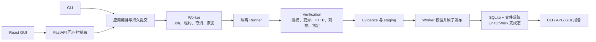

# 界鉴架构说明

## 系统怎么运行

当前系统是模块化单体，但主动验证被放进独立 Runner 进程。CLI 负责接收命令，Worker 负责任务和进程，只有 Runner 可以向授权目标发请求。



## 各部分负责什么

| 部分 | 负责 | 不负责 |
| --- | --- | --- |
| CLI | 解析参数、校验输入、提交 Job、等待结果、展示 JSON 和退出码。 | 不直接发目标请求，不操作 ORM，不复制安全判定。 |
| API / GUI | 管理项目、录制、Run、事件和已发布结果；GUI 只调用 API。 | 不执行目标请求，不在页面中复制状态机或判定。 |
| 应用编排与提交 | 把已校验的项目内容保存为不可变请求快照，并用 request hash 幂等创建 Run/Job。 | 不重新实现 Verification，不把真实秘密写入快照。 |
| Worker | claim Job、维护租约、启动和监督 Runner、处理取消/重试、校验并发布工件、恢复崩溃窗口。 | 不执行 HTTP 攻击请求，不直接决定 `PASS` 或 `BLOCK`。 |
| Runner | 严格解析 RunnerInputV1，在当前 attempt 内调用 Verification，并生成 RunnerResultV1 与 staging 工件。 | 不读取可变 YAML，不写数据库，不直接发布最终目录。 |
| Verification | 执行目标授权、关系变异、HTTP 请求、多观察者判定、Evidence 构建和门禁聚合。 | 不依赖 SQLite、Worker 或 CLI。 |
| Storage / Evidence | SQLite 保存状态、事件和索引；文件系统保存 Evidence、报告和较大工件。 | 数据库不保存响应正文、真实秘密或大型工件。 |

相关实现的快速入口见 [模块地图](模块地图.md)，逐文件职责见[详细模块地图](01_架构设计/模块地图.md)。录制闭环的公开入口是 `jiejian recording`，其持久化、草稿审阅和回放仍复用同一 Worker/Runner 边界。

## 一次运行的关键步骤

1. CLI 从 `project.yaml` 加载项目，并校验 Flow、Contract、目标范围和引用关系。
2. 提交服务把路径无关的内容快照写入 `<var_dir>/jobs/<job_id>/request.json`，数据库保存同一请求的 SHA-256。
3. Worker claim Job，增加 attempt 和 Fencing Token，并建立有期限的租约。
4. Worker 根据快照构造 RunnerInputV1，只把本次需要的 `env:NAME` 真实值放入最小子进程环境。
5. Runner 执行基线和关系变异；每次请求都经过目标范围和预算检查。
6. Verification 比较 HTTP 结果与 owner API 的前后状态，构建 Evidence，并聚合门禁结论。
7. Runner 只把 RunnerResultV1 和工件写入当前 attempt 的 staging。
8. Worker 重新校验关联 ID、Fencing Token、路径、字节数和 SHA-256，然后原子发布完整目录。
9. 发布成功后，Worker 才在一个 UnitOfWork 中写 Run、Job、Job Event 和 Evidence Index 完成态。
10. CLI 根据数据库终态和已发布结果展示结论；`report` 重新校验 manifest 与报告哈希。

录制闭环使用相同的控制面：CLI 提交 Recording Job，Recording Runner 只输出脱敏事件，处理器生成 `FlowDraftV1`；用户通过 review 确认步骤和变量来源后，finalize 原子发布 `flow.json` 并推进 `Recording`。replay 为每次回放创建新的 Job 和 BrowserContext，CLI 不直接发请求。

## 三个容易混淆的概念

### Fencing Token

Fencing Token 是 Job 每次成功 claim 时递增的正整数。租约过期不代表旧 Runner 已经死亡，所以 Worker 的续租、结果、发布和状态更新都必须同时匹配 `job_id`、`lease_owner` 和当前 Fencing Token。旧 token 即使晚到，也不能覆盖新尝试。

### staging

staging 是某个 attempt 的暂存目录。Runner 只能写这里，不能写最终运行目录或数据库完成态。这样，半写文件、协议错误和失败尝试不会被当作正式证据。

### 原子发布和 UnitOfWork

Worker 完整校验 staging 后，用同一文件系统内的原子重命名一次性发布整个目录。只有发布成功，才通过 UnitOfWork 在一个数据库事务中更新 Run、Job、事件和 Evidence 索引。如果目录已经发布但数据库提交失败，reconciliation 会重校验并幂等补齐，而不是重复执行目标请求。

详细规则见 [Runner 执行协议 V1](04_协议定义/Runner执行协议V1.md)、[ADR-0006](03_技术决策/ADR-0006-阶段2隔离执行设计.md) 和 [ADR-0007](03_技术决策/ADR-0007-阶段2工件发布与恢复.md)。

## ownership safe / vulnerable 样例

先在两个终端启动只监听环回地址的配对样例：

```powershell
python -B -m jiejian.sample_app --variant safe --port 8765
python -B -m jiejian.sample_app --variant vulnerable --port 8766
```

在执行 CLI 的终端提供样例使用的无效测试令牌：

```powershell
$env:JIEJIAN_SAMPLE_OWNER_TOKEN = "sample-owner-token"
$env:JIEJIAN_SAMPLE_ATTACKER_TOKEN = "sample-attacker-token"
```

然后分别运行：

```powershell
jiejian ci .\samples\fixed_apps\ownership\project.yaml
jiejian ci .\samples\vulnerable_apps\ownership\project.yaml
```

两次运行都包含正常基线、身份或资源关系变异以及 owner API 前后观察：

- safe 版本拒绝越权请求且没有后端副作用，因此得到 `PASS`，CI 退出码为 0；
- vulnerable 版本也可能返回 `403`，但 owner API 能看到资源已经被修改，因此 Evidence 记录 `VULNERABLE`，门禁得到 `BLOCK`，CI 退出码为 1。

这正是项目不把 HTTP `403` 直接当作安全结论的原因。
