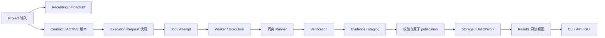

# 界鉴架构说明

界鉴是模块化单体，使用独立 Worker 和 Runner 建立高风险执行边界。CLI、回环 API 和 React GUI 共享 ApplicationContext 与能力服务；它们不复制 Verification、Contract 或状态机规则。

## 能力边界

| 能力 | 当前定位 | 明确不负责 |
| --- | --- | --- |
| `projects` | Project 登记、来源完整性、YAML Contract 兼容和观察器解析。 | 不拥有执行请求或 Contract Governance 规则。 |
| `contracts` | Requirement、候选、Contract 版本、assessment、drift、LLM profile/候选和工作台。 | 不直接执行目标；LLM 不决定 Run Verdict，也不能绕过治理链。 |
| `recording` | 浏览器录制、脱敏、FlowDraft 审阅、Recording Job 和 replay。 | 不被 Execution 反向导入；不把短录制伪装成完整 Flow。 |
| `verification` | 纯模型、输入校验、授权、变异、观察、判定和 Evidence。 | 不依赖 Storage、Worker、API 或具体 LLM。 |
| `execution` | 通用 Job/Attempt、租约、取消、恢复、监督、发布和两类 JobHandler 端口。 | 不包含 Recording 规则，不反向依赖 Recording。 |
| `storage` | SQLite、ORM/Repository、事务、原子 Job 控制和迁移资源定位。 | 不执行目标请求，不决定安全结论。 |
| `protocols` | Runner/Recording/FlowDraft 的可执行 V1 模型和严格边界。 | 不承担业务编排。 |
| `api` / `cli` / `frontend` | 分别提供回环控制面、正式命令入口和用户界面。 | 不复制领域算法或绕过 Job/Runner 边界。 |
| `runtime` / `results` | `serve` 资源生命周期、单实例锁，以及已发布结果的完整性读取。 | Runtime 不做 Verification；Results 不重跑、不改 Verdict。 |

模型服务设置由 `contracts/llm/profiles.py` 和 `/api/v1/llm/profiles` 提供；`secret_ref` 只引用环境变量或 Windows Credential Manager，明文秘密不进入 Storage、响应、日志或前端存储。`GET /api/v1/system/status` 只读观察 API、Worker 和本机 Chromium 可用性，不启动浏览器、不访问目标。

## 主链和信任边界

1. Project 通过相对路径和目标范围校验形成自包含输入。
2. Recording 或 Contract 产生的可用事实经过审阅/激活，执行时冻结为不可变 request snapshot。
3. Job 被 Worker 原子 claim，租约和 fencing token 绑定当前 attempt。
4. Runner 只获得本次所需秘密和请求快照，在授权范围、预算和协议约束内发出目标请求。
5. Verification 生成 RunnerResultV1、Evidence 和 staging；Worker 校验关联 ID、token、路径、哈希和文件集合。
6. publication 成功后，Storage 在 UnitOfWork 中提交 Run、Job、事件和 Evidence Index；Results 只读复验 manifest、DB 状态、fencing 和哈希。

API/CLI/GUI 与 Worker/Runner 的进程边界、秘密最小化、fencing、事务顺序和失败恢复是项目级不变量。字段级协议见[数据格式导航](04_协议定义/数据格式.md)和[Runner 执行协议 V1](04_协议定义/Runner执行协议V1.md)；原因见[ADR 索引](03_技术决策/README.md)。

## 用户入口

- Windows 首次准备：`start.cmd` 薄转发到 `scripts/start.ps1`。
- 稳定产品入口：`jiejian serve --open`。
- CLI 正式安装入口：`jiejian.cli:main`。
- API 正式入口：`jiejian.api:create_app`。
- 单任务 Worker 稳定入口：`jiejian.worker.runtime`。
- Runner 与 Recording Runner 通过 `python -m jiejian.runner`、`python -m jiejian.recording_runner` 发现和启动。
