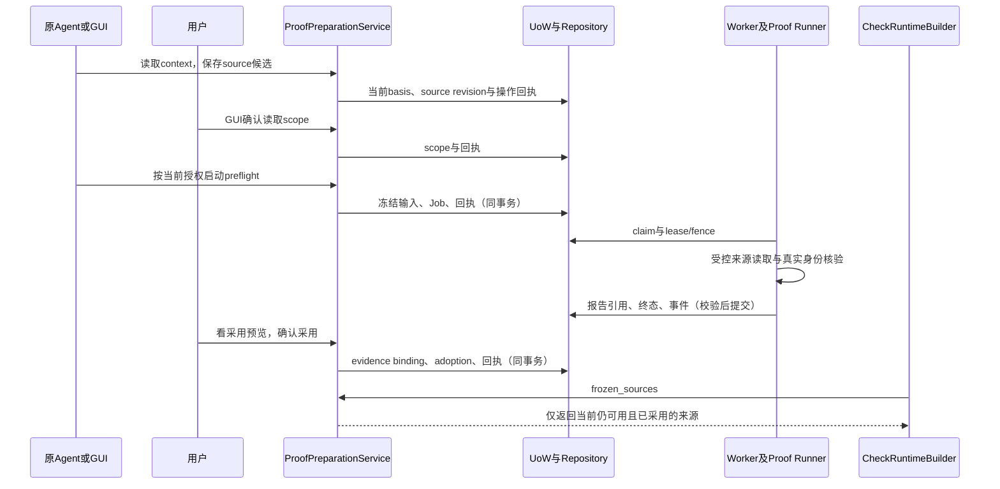

# 修改证明来源

> 状态：CURRENT。说明当前能力的唯一所有者、修改位置、直接消费者与验证。

这篇处理证明来源配置、读取授权、独立预检查、采用、撤权和响应未知后的恢复。主要所有者是 `product/backend/workflows/preparation/proofs/service.py::ProofPreparationService`。

如果只是某个材料被判失效，先查 `product/backend/workflows/preparation/bindings/sources.py::BindingSourceInspector`；如果要改PASS/BLOCK规则，进入权限判断指南。证明预检查的USABLE只表示技术准备条件成立。

## 快速找到修改位置

| 要改什么 | 主要位置 | 必须一起核对 | 直接测试 |
| --- | --- | --- | --- |
| 上下文、配置依据、旧修订拒绝 | `product/backend/workflows/preparation/proofs/service.py` 的 context、_facts、_current、save | commands模型、GUI/MCP输入、来源revision与basis | `tests/backend/workflows/preparation/proofs/test_proof_sources.py` |
| 读取scope、撤权与取消 | 同服务的 grant_scope、_scope_matches、revoke_scope、job_authorized | MCP授权回调、Job取消、发布时scope复核 | `tests/backend/workflows/preparation/proofs/test_proof_fail_closed.py` |
| 提交/读取/发布预检查 | `product/backend/workflows/preparation/proofs/jobs.py::ProofPreflightJobs` | proof_runner、Job attempt/fence、ProofReportStore | 上述fail_closed与 `tests/backend/api/preparation/test_proof_preparation.py` |
| 采用条件与运行复用 | service.py 的 _adoptable、adopt、active_sources、frozen_sources | evidence binding、runtime_bundle与受控记录契约 | `tests/backend/workflows/preparation/proofs/test_proof_reuse.py`、`test_proof_check.py`（同目录） |
| 真实记录与来源合同 | `product/backend/infra/observers/records/source_contracts.py` | 受控实例、通用记录组件、冻结contract与Runner观察 | Observer、运行加载及proof相关直接测试按实际改动选取 |
| 未知响应、刷新恢复、项目切换 | `product/frontend/src/features/preparation/proof-sources/useProofSources.ts`、`proofSourceOperations.ts`（同目录） | `ProofSourcesPanel.tsx`、原项目键、后端receipt(project,kind,operation) | `product/frontend/src/features/preparation/proof-sources/ProofSourcesPanel.test.tsx` |
| GUI/MCP调用入口 | `product/backend/api/routers/preparation/proof_sources.py`、`product/backend/api/mcp/preparation.py` | 共用service与严格commands；MCP不代人grant/adopt | `tests/backend/api/preparation/test_proof_preparation.py`、`tests/backend/api/system/test_mcp.py` |

## 一次来源怎样进入检查

图省略传输层和普通错误封装；API不在请求处理中发预检查目标流量。正式CHECK后来重新按冻结来源执行验证，本次预检查没有安全Verdict。

## 谁拥有事实

- `PreparationFacts` 是服务在本次事务中读取的边界、源码、账号、资源、运行和basis，只存在内存。
- `ProofSourceRevision` 保存来源配置及修订；`SourceReadScope` 保存用户确认的读取边界。配置不是授权，授权不是采用。
- `ProofPreflightJobs.submit` 复用调用方UoW，创建不可变预检查输入、Job与事件；外层 `_operation` 写入同一个操作回执并提交。
- `ProofPreflightJobs.publish` 先保存报告工件，再在写事务中校验请求、scope、报告内容及attempt/fence/lease，并关联report hash和完成Job。文件存在本身不表示发布接受。
- `adopt` 在同一个 `_operation` 事务中写入 `ActionEvidenceBinding`、采用记录和回执；确认前重新核对basis、source revision、runtime、报告与记录合同。
- `active_sources` 每次重新检查采用修订、binding指纹及有效预检查；新实例不能凭旧READY继续。`frozen_sources`供正式检查构建使用。

## 修改时保留的边界

1. 原Agent可以协助填写候选和启动获授权的预检查；正式权限、读取范围、采用由人确认。GUI/MCP共用服务，不在工具或页面复制审批算法。
2. `_operation` 先取写锁、查project/kind/operation_id。相同输入返回已有回执，同键异文拒绝；不能把业务写入和回执拆开提交。
3. basis、scope、source revision、runtime instance、账号和资源的任何相关变化都必须重新核验；不能仅凭“上次USABLE”采用。
4. 撤销scope影响对应任务与后续采用；重新授予不能复活旧授权提交的任务。保持检查提交和运行时的各自核验。
5. CHECK根格式、canonical和冻结字段若要改变，先按公共协议流程决定；纯页面说明不得改变这些字段。

## 失败先查哪里

| 症状 | 先读的权威事实 | 正确恢复方向 |
| --- | --- | --- |
| 保存后网络响应未知 | 原项目、operation kind、operation_id的receipt | 页面只查原回执，不换新键重放；存储无法保留操作身份时阻止写请求 |
| 预检查USABLE但采用被拒绝 | `_adoptable`比较的source revision/basis/runtime/scope/contract | 找到失效依据后更新准备或重新预检查；不放松校验来消除提示 |
| Job已结束但页面还在轮询 | status、Job/report关联、useProofSources当前项目引用 | 修正事实回读/陈旧响应处理；不在页面伪造完成 |
| 撤权后任务仍显示运行 | job_authorized、scope、cancel请求与真实Job终态 | 核对取消与Runner收口；区分“已请求取消”和“已清理结束” |
| 新实例上旧来源不能用 | active_sources与当前runtime_reference | 同配置先重新核验新实例；修订变更需重新采用 |
| 报告工件存在但无可用结果 | ProofPreflightJobs.read中的DB引用、hash和Job关联 | 不绕过reader直接展示工件为成功，不重复执行目标试探 |

## 最小验证

- 只改来源采用条件：先选 `test_proof_sources.py`/`test_proof_reuse.py`相关用例，再加 `test_proof_check.py`的冻结消费者。
- 改撤权或basis：先选 `test_proof_fail_closed.py`，如果动到API/MCP授权，再加相应控制面测试。
- 只改未知回执UI：运行ProofSourcesPanel组件测试；核对项目切换、刷新、旧响应、持久化失败和已成功回读，不触发整个后端L4。
- 改跨进程格式：再加入协议、严格reader和publication直接测试。是否需要进程集成由真实改动决定。

正式后端和前端入口分别为 `dev.ps1 test`、`dev.ps1 frontend-test`，遵循验证规范的完整PowerShell调用。现有检查点按生产输入、测试和工具环境有效性复用。

## 按需深入

[来源契约](证明来源契约.md)、[来源协作](来源协作.md)、[MCP授权](../控制面/修改MCP与授权.md)、[运行加载](../应用接入/修改运行加载.md)。
